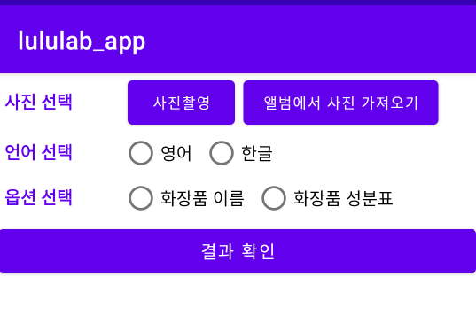
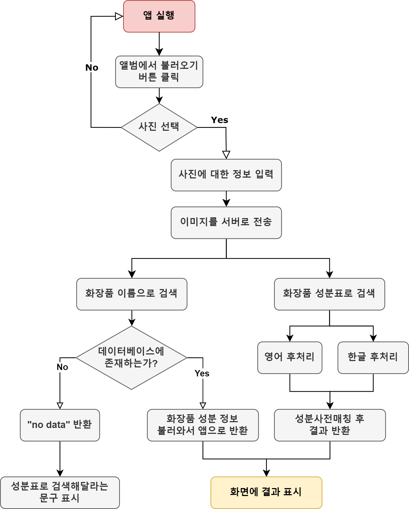

# 데모 안드로이드 애플리케이션
구현 완료한 안드로이드 애플리케이션의 동작 시나리오는 다음과 같다.
1. 갤러리에서 이미지를 불러온다. 크롭기능이 없으므로 이미 크롭되어 있는 이미지를 불러와야 한다. 불러온 이미지는 base64로 인코딩되어 json object에 저장된다. 
2. 화장품 이름으로 검색하는지, 화장품 성분표로 검색하는지 옵션을 선택한다. 옵션 선택 결과도 json object에 저장된다.
3. 성분표가 한글로 되어 있는지, 영어로 되어 있는지, 언어를 선택한다. 언어 선택 결과도 마찬가지로 json object에 저장된다. 화장품 이름으로 검색하기를 선택했다면 언어 선택은 하지 않아도 된다. 
4. "결과 확인" 버튼을 누르면 저장한 json object의 내용이 string으로 변환되어 서버로 전송된다.
   + 화장품 이름으로 검색하는 경우: 이미지에서 인식한 텍스트가 화장품 이름이므로 이를 화장품 데이터베이스에서 찾고, 그 화장품의 성분정보를 알아낸다. 만약 화장품 데이터베이스에 없는 경우 "no data"를 반환하고, 안드로이드 앱에서 성분표로 검색해달라는 문구를 표시한다.
   + 성분표로 검색하는 경우: 언어 정보에 따라 다르게 동작한다. 이미지에서 인식한 텍스트는 화장품의 성분표이며, 이를 후처리 코드를 통해 성분사전과 매칭한다.  
5. 서버에서 결과를 받는다. String을 JsonArray로 변환하고 파싱한 후, 화면에 ListView를 이용해 표시한다. 리스트에는 성분명, 효능, 위험도를 표기한다.

