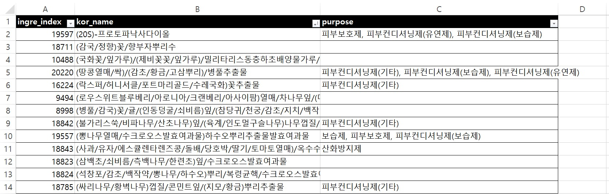

# 후처리 코드
 
 `app.py`는 앱에서 전송한 정보를 받아 성분사전매칭을 진행한 뒤 그 결과를 다시 앱으로 전송하는 프로그램입니다.
 `app.py`와 필요한 파일을 서버에 올린 뒤에 이 파일을 실행시키면 됩니다. 
 ```
 python app.py
 ```
 
 ## Requirements
 `app.py`를 실행하기 위해 필요한 파일들입니다.
 + ### cosmetic_DB.xlsx
   이미 성분정보가 수집된 화장품들에 대한 정보가 딤긴 파일이자, 화장품 이름과 각 화장품에 포함된 성분들이 정리된 파일입니다.  
   '화장품 이름으로 검색하기' 옵션을 선택했을 때, 화장품 이름이 포함된 이미지에서 OCR로 텍스트를 인식한 뒤, 추출한 텍스트를 이 파일 안에서 찾습니다. 
   만약 찾는다면 이미 성분정보를 수집한 화장품이므로 바로 해당 화장품의 성분정보를 제공합니다. 
   만약 찾지 못한다면 아직 성분정보를 수집하지 못했거나 OCR 인식에서 오류가 있었던 것이므로 'no data'를 반환하고, 화장품 이름이 아닌 화장품 성분표로 다시 검색하도록 합니다.  
   엑셀 파일에는 2개의 열이 있습니다. `name` 열에는 화장품 이름이, `ingredient list` 열에는 각 화장품에 포함된 성분이 기록되어 있습니다.
   
 + ### frequency_dictionary_kor_ingredients.txt
   이 파일은 한글 성분표에 대한 성분사전매칭에 사용됩니다. 각 성분들의 빈도수가 정리된 파일입니다.  
   한글 성분표에 대한 성분사전매칭에서 symspell이 사용되는데 symspell은 어떤 문자열의 오타를 수정하기 위해서 max_editdistance 내의 후보군을 만들고, 그 중 가장 편집거리가 적으면서, 빈도수가 높은 것을 최종 결과로 선택합니다. 본 프로젝트에서는 각 성분들의 빈도수를 파악하기에 자료가 부족했기 때문에 모두 1로 설정했습니다. 그러나 빈도수가 모두 같기 때문에 가장 작은 편집거리를 가진 후보군이 여러 개 나올 경우 어떤 후보군을 선택해야 하는지 판단하는 과정이 필요합니다. 이를 위해 symspell과 diff()를 모두 사용했습니다. symspell 결과를 가지고 diff()를 통해 가장 유사한 문자열을 찾을 수 있도록 했습니다. 만약 시중에 판매되는 화장품 속 성분들의 빈도수를 파악할 수 있다면 해당 정보가 이 파일에 담겨야 하며, 이를 통해 매칭 정확도를 더 높일 수 있을 것입니다.
   ```
   "성분명 빈도수"
   
   가공소금 1
   가지열매추출물 1
   구멍쇠미역추출물 1
   루핀아미노산 1
   류신 1
   ...
   ```
  + ### ingre.xlsx
    영어 성분표에 대한 성분사전 매칭에 사용되는 성분사전입니다. 
    기존에 룰루랩에서 제공받은 ingredients.xlsx를 수정했습니다. `eng_name`열에 있는 데이터를 소문자로 바꾼 `lower`열을 추가했습니다. 영어성분표에 대한 성분사전 매칭에서는 OCR 결과를 모두 소문자로 바꾼 다음, `lower`열에 있는 데이터와 비교하도록 했습니다.
    
  
  + ### ingre_kor.xlsx
    한글 성분표에 대한 성분사전 매칭에 사용되는 성분사전입니다.
    기존에 룰루랩에서 제공받은 ingredients.xlsx를 수정했습니다. eng_name 열과 other_name 열을 없앴습니다.
    
  
  + ### lululab-ocr-b3ae0ebfee0d.json 
    Google cloud vision api를 사용하기 위해 받은 key입니다. 만약 다른 key를 사용한다면 이 파일을 다른 파일로 바꿔준 다음 `app.py`의 21번 줄의 `path`를 수정해주어야 합니다.
    ```
    path = "lululab-ocr-b3ae0ebfee0d.json"
    os.environ["GOOGLE_APPLICATION_CREDENTIALS"] = path
    ```
